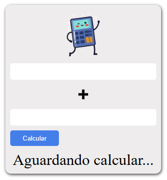

# 🧮 Modular Calculator (Vanilla JS)

Mini projeto de calculadora de somar desenvolvido com JavaScript puro (Vanilla JS), com foco em organização de código, modularização e separação de responsabilidades.

Demo: 
---

## 📌 Objetivo do Projeto

Este projeto foi criado para praticar:

- Estrutura de pastas
- Modularização com ES Modules
- Separação de responsabilidades
- Validação de dados
- Manipulação do DOM
- Organização de código em pequena escala

---

## 🗂 Estrutura do Projeto
soma-app/
│
├── assets/
│ └── images/
│ ├── cute-calculator-cartoon.svg
│ ├── plus-symbol-button.svg
│ └── screenshot.png
│
├── css/
│ └── style.css
│
├── js/
│ ├── main.js
│ ├── math.js
│ ├── ui.js
│ └── validation.js
│
├── index.html
└── README.md

### Responsabilidades:

- **math.js** → Regras de negócio (função de soma)
- **validation.js** → Validação dos dados de entrada
- **ui.js** → Manipulação e atualização da interface
- **main.js** → Orquestração do fluxo da aplicação

---

## ⚙️ Funcionalidades

- Soma de dois números
- Validação de campos vazios
- Validação de valores numéricos
- Exibição de mensagens de erro
- Limpeza automática da mensagem ao digitar
- Layout estilizado em formato de card

---

## 🧠 Conceitos Aplicados

- ES Modules (`import` / `export`)
- Event Listeners
- Manipulação de classes CSS dinamicamente
- Separação entre lógica, validação e interface
- Princípio da responsabilidade única

---

## 📷 Preview

---

## 📚 Aprendizados

Este projeto marcou uma evolução na organização do código, saindo de scripts únicos para uma estrutura modular mais profissional.

---

## 🛠 Tecnologias Utilizadas

- HTML5
- CSS3
- JavaScript (ES6+)

---

## 📄 Licença

Projeto desenvolvido para fins de estudo.